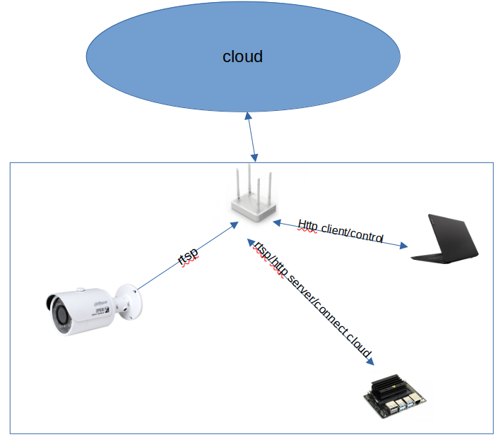

# What it is
+ This is customized example from [darknet](https://github.com/AlexeyAB/darknet/) for C++ for recongize objects in minimal configuration.

+ Main purpose of this project is customize the darknet project to minimal version to can run on Jetson Nano for create *a security camera ( human detector )* 

+ This supported backend system for notifying

# Dependencies
+ [opencv 4.1.1](https://pysource.com/2019/08/26/install-opencv-4-1-on-nvidia-jetson-nano/)
+ [cuda-10.2](https://jfrog.com/connect/post/installing-cuda-on-nvidia-jetson-nano/)
+ [asio](https://think-async.com/Asio/asio-1.24.0/doc/asio/using.html)
# How to run
Tested on Jetson nano 2GB.
## Build
```
git clone --recursive https://github.com/vuhailongkl97/iot.git
cd iot && git lfs pull
mkdir build && cd build
cmake ..  &&  make

```
## Edit configuration and Run
### Edit configuration file
`/etc/iot-config.yaml` follow [config.yaml](https://github.com/vuhailongkl97/iot/blob/master/iot-config.yaml)
```
TIME_FORCUS: 2  // All Frames in 2sec are person will be consider to be a correct result
TIME_SKIP: 20  // After have detected result -> SKIP in next 20 secs
QUEUE_ENTRY_LIMIT_MIN: 15  // Use a queue whose size is 15 to save all Frames in TIME_FORCUS seconds
NotifyAPI: http://localhost:1234/updated // after it have a result -> notify by create a HTTP request with **NotifyAPI** (also see below)
Delay4CAP: 20 // if your board too overload by high Frames speed from source -> increase this to reduce captured Frames;
Port: 18080  // Port for this app to change parameter dynamically
#NameFile: < path to >iot/darknet-deps/data/coco.names 
#CfgFile: < path to > iot/darknet-deps/cfg/yolov4-tiny.cfg
#WeightFile: < path to > iot/darknet-deps/data/yolov4-tiny.weights
Threshold: 0.6 // threshold for the darknet detector
Src: ../test-data/videoplayback.mp4
CorrectRate: 0.9
#BoardName: JetsonNano // if used board is JetsonNano -> support Log file at /tmp/rotating.txt
```

### Run
`./iot `  
a demo from my camera:  


# Development
1. Testing stability
	+ Debugging via reporting results
	+ Aging 
	+ Correctness
2. Develop notifying via HTTP request

# Diagrams
## usecase 


# Note: 
+ OS information `Linux jetson 4.9.140-tegra #1 SMP PREEMPT Fri Oct 16 12:32:46 PDT 2020 aarch64 aarch64 aarch64 GNU/Linux`
+ Install vino VNC follow `JetsonNano-RemoteVNCAccess.pdf`
+ Use vncviewer on your host in development 
	- Ubuntu ` sudo apt install xtightvncviewer -y`
+ Due to I use *yolov3.weight* as default but its size too big need to use [git large file](https://git-lfs.github.com/). 
+ Try to adjust your frame to fit with trained data set (416x416) in case of using yolov4-tiny.weights  

# APIs 
` curl http://192.168.55.1:18080/threshold/80 ` -> requeset to set threshold with accurate rate is 80%
 
` curl http://192.168.55.1:18080/disable/1 ` -> stop detecting ( the application will be in waiting state )

` curl http://192.168.55.1:18080/disable/0 ` -> enable detection if the application was in waiting state otherwise it has no effect.

` /usr/bin/curl http://localhost:1234/updated -X POST -d "/tmp/img.png" ` -> notify an updated event to localhost:1234 with data is path of detected image.
# Libraries are used (as submodules)
+ [Crow](https://github.com/ipkn/crow) - socket management
+ [spdlog](https://github.com/gabime/spdlog) - logging 
+ [backward-cpp](https://github.com/bombela/backward-cpp) - a good backtrace when the system is crashed
+ [yaml-cpp](https://github.com/jbeder/yaml-cpp) - read/write configuration in yaml format

# Reference
+ [download_weights](https://github.com/AlexeyAB/darknet/blob/master/scripts/download_weights.ps1)

+ [yolov3.weight](https://pjreddie.com/media/files/yolov3.weights)
+ [dahua API](https://community.jeedom.com/uploads/short-url/tTQJPaNah7gZnU12VGGN9ZHEhOk.pdf)

# More
## Configure systemd
To make the app run as a service in your Linux system:  
follow [this](https://wiki.archlinux.org/title/systemd), and [my config](https://github.com/vuhailongkl97/iot/blob/master/iot.service)
