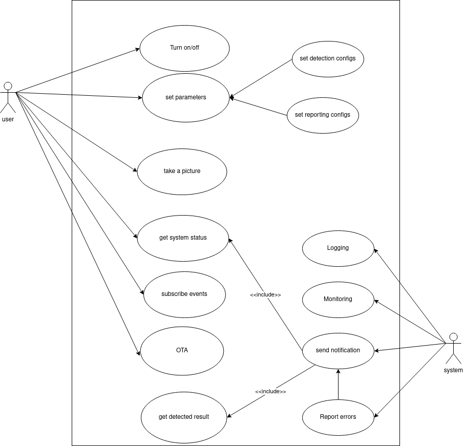

# What it is
+ This is customized example from [darknet](https://github.com/AlexeyAB/darknet/) for C++ for recongize objects in minimal configuration.

+ Main purpose of this project is customize the darknet project to minimal version to can run on Jetson Nano for create *a security camera ( human detector )* 

+ This will support backend system for notifying

# Dependencies
+ [opencv 4.1.1](https://pysource.com/2019/08/26/install-opencv-4-1-on-nvidia-jetson-nano/)
+ [cuda-10.2](https://jfrog.com/connect/post/installing-cuda-on-nvidia-jetson-nano/)
# How to run
Tested on Jetson nano 2GB.
```
git clone --recursive https://github.com/vuhailongkl97/iot.git
cd iot && git lfs pull
mkdir build && cd build
cmake ..  &&  make

```
run the built application follow by video source from rtsp, video, http,..  
`./iot rtsp://<path to source video` or  
`./iot ../test-data/videoplayback.mp4`

# Development
1. Testing stability
	+ Debugging via reporting results
	+ Aging 
	+ Correctness
2. Develop backend system management with Golang

# Diagrams
## usecase 


# Note: 
+ OS information `Linux jetson 4.9.140-tegra #1 SMP PREEMPT Fri Oct 16 12:32:46 PDT 2020 aarch64 aarch64 aarch64 GNU/Linux`
+ Install vino VNC follow `JetsonNano-RemoteVNCAccess.pdf`
+ Use vncviewer on your host in development 
	- Ubuntu ` sudo apt install xtightvncviewer -y`
+ Due to I use *yolov3.weight* as default but its size too big need to use [git large file](https://git-lfs.github.com/). 


# Reference
+ [download_weights](https://github.com/AlexeyAB/darknet/blob/master/scripts/download_weights.ps1)

+ [yolov3.weight](https://pjreddie.com/media/files/yolov3.weights)
+ [dahua API](https://community.jeedom.com/uploads/short-url/tTQJPaNah7gZnU12VGGN9ZHEhOk.pdf)
